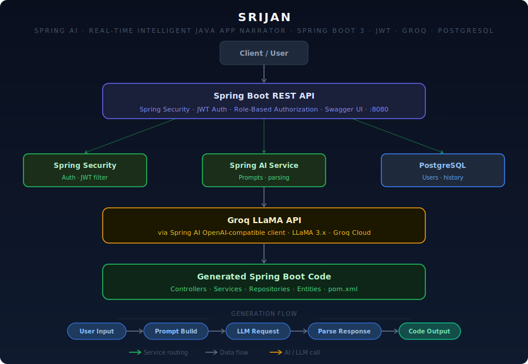

# ⚡ SRIJAN (Spring AI : Real-time Intelligent Java App Narrator) — AI-Powered Spring Boot Code Generator

> Describe your feature in plain English. SRIJAN generates production-ready Spring Boot code — instantly.

[](https://openjdk.org/)
[](https://spring.io/projects/spring-boot)
[](https://react.dev/)
[](https://www.postgresql.org/)
[](https://www.docker.com/)
[](https://srijan-app.netlify.app)
[](https://srijan-backend-0w0d.onrender.com)

---
## Architecture



---
## 🔗 Live Demo

| Service  | URL |
|----------|-----|
| 🌐 Frontend | https://srijan-app.netlify.app |
| 🔧 Backend API | https://srijan-backend-0w0d.onrender.com |

---

## 📌 What is SRIJAN?

**SRIJAN** (which means *creation* in Sanskrit)

SRIJAN is an AI-powered Spring Boot code generator that lets you describe your application in plain English and instantly get working, production-ready Java code. Built on top of Spring AI and powered by Groq's LLaMA model, SRIJAN bridges the gap between your ideas and implementation — no boilerplate, no guesswork.

The generated files are rendered inside a Monaco Editor and can be downloaded as a ready-to-use ZIP file.

---

## ✨ Features

- 🤖 **AI Code Generation** — Powered by Groq's `llama-3.3-70b-versatile` model via Spring AI
- 💬 **Multi-turn Chat Memory** — Continue refining your code with follow-up prompts in the same session
- 📝 **Monaco Code Editor** — View all generated files in a VS Code-like editor with syntax highlighting
- 📦 **ZIP Download** — Download the entire generated project as a ZIP file, ready to open in any IDE
- 🔐 **JWT Authentication** — Secure login/register with Spring Security 6 and JWT tokens
- 🗂️ **Session Persistence** — Chat sessions are saved to PostgreSQL, linked to your user account
- 🐳 **Dockerized Backend** — Multi-stage Docker build for lightweight production deployment

---

## 🛠️ Tech Stack

### Backend
| Technology | Purpose |
|------------|---------|
| Java 17 | Core language |
| Spring Boot  | Backend framework |
| Spring AI 1.0.0-M6 | AI integration (OpenAI-compatible) |
| Groq API (`llama-3.3-70b`) | LLM for code generation |
| Spring Security 6 | Authentication & authorization |
| JWT (jjwt 0.12.3) | Stateless token-based auth |
| Spring Data JPA + Hibernate | ORM and database access |
| PostgreSQL | Relational database |
| Lombok | Boilerplate reduction |
| Docker | Containerization |

### Frontend
| Technology | Purpose |
|------------|---------|
| React 19 | UI framework |
| Vite 8 | Build tool & dev server |
| React Router DOM 7 | Client-side routing |
| Axios | HTTP client with JWT interceptor |
| Monaco Editor | In-browser code viewer |
| Tailwind CSS | Utility-first styling |
| React Hot Toast | Toast notifications |

---

## 🚀 Getting Started (Local Setup)

### Prerequisites
- Java 17+
- Maven 3.8+
- Node.js 18+
- PostgreSQL (local or cloud)
- Groq API key (free at [console.groq.com](https://console.groq.com))

---

### Backend Setup

**1. Clone the repository**
```bash
git clone https://github.com/ritik-hedau18/SRIJAN
cd srijan-backend
```

**2. Create a PostgreSQL database**
```sql
CREATE DATABASE srijan_db;
```

**3. Set environment variables**

Create a `.env` file or set the following in your IDE run configuration:
```
GROQ_API_KEY=your_groq_api_key_here
SPRING_DATASOURCE_URL=jdbc:postgresql://localhost:5432/srijan_db
SPRING_DATASOURCE_USERNAME=your_db_username
SPRING_DATASOURCE_PASSWORD=your_db_password
JWT_SECRET=your_jwt_secret_key_minimum_32_chars
CORS_ORIGIN=http://localhost:5173
```

**4. Run the application**
```bash
./mvnw spring-boot:run
```
The backend will start at `http://localhost:8080`

---

### Frontend Setup

**1. Clone the repository**
```bash
git clone https://github.com/ritik-hedau18/srijan-frontend.git
cd srijan-frontend
```

**2. Install dependencies**
```bash
npm install
```

**3. Create `.env` file**
```
VITE_API_URL=http://localhost:8080
```

**4. Start the dev server**
```bash
npm run dev
```
The frontend will be available at `http://localhost:5173`

---

### Docker Setup (Backend only)

```bash
docker build -t srijan-backend .

docker run -p 8080:8080 \
  -e GROQ_API_KEY=your_key \
  -e SPRING_DATASOURCE_URL=jdbc:postgresql://host.docker.internal:5432/srijan_db \
  -e SPRING_DATASOURCE_USERNAME=postgres \
  -e SPRING_DATASOURCE_PASSWORD=yourpassword \
  -e JWT_SECRET=your_secret \
  srijan-backend
```

---

## 🔌 API Reference

### Auth Endpoints
| Method | Endpoint | Description | Auth Required |
|--------|----------|-------------|---------------|
| POST | `/api/auth/register` | Register new user | ❌ |
| POST | `/api/auth/login` | Login, returns JWT | ❌ |

### AI Endpoints
| Method | Endpoint | Description | Auth Required |
|--------|----------|-------------|---------------|
| POST | `/api/ai/generate` | Generate code from prompt | ✅ |
| GET | `/api/ai/download/{sessionId}` | Download generated ZIP | ❌ |
| GET | `/health` | Health check | ❌ |

### Sample Request — Generate Code
```http
POST /api/ai/generate
Authorization: Bearer <your_jwt_token>
Content-Type: application/json

{
  "prompt": "Create a REST API for a student management system with CRUD operations",
  "sessionId": null
}
```

### Sample Response
```json
{
  "sessionId": "3f2a1c4d-...",
  "downloadUrl": "/api/ai/download/7e9b2a...",
  "files": [
    {
      "filePath": "src/main/java/com/example/controller/StudentController.java",
      "content": "..."
    },
    {
      "filePath": "src/main/java/com/example/service/StudentService.java",
      "content": "..."
    }
  ]
}
```

---

## 💡 How Code Generation Works

1. **User sends a prompt** — e.g., *"Build a product inventory API with search"*
2. **Session is created** (or reused for follow-up messages) and saved to PostgreSQL
3. **Spring AI sends the prompt** to Groq's llama model with a custom system prompt that instructs it to return code using `=== FILE: <path> ===` markers
4. **CodeParser splits the response** into individual `ParsedFile` objects (filePath + content)
5. **ProjectGeneratorService** writes each file to a temporary directory and compresses them into a ZIP
6. **Frontend receives** the file list (rendered in Monaco Editor) and a download URL

---

## 🔐 Security

- Passwords are hashed using **BCrypt**
- JWT tokens expire after **24 hours** (configurable via `jwt.expiration`)
- All `/api/ai/**` endpoints except `/download/**` require a valid JWT
- CORS is configured to allow only the frontend origin
- Spring Security 6 with stateless session (no HttpSession used)

---

## 🌐 Deployment

| Service | Platform | Notes |
|---------|----------|-------|
| Backend | [Render](https://render.com) | Multi-stage Docker build, free tier |
| Frontend | [Netlify](https://netlify.com) | Vite build, `_redirects` for SPA routing |
| Database | PostgreSQL (cloud) | Connected via `SPRING_DATASOURCE_URL` env var |

---

## 🙋 Author

**Ritik Hedau**  
Java Full Stack Developer | Spring Boot | React  
📍 India

[](https://github.com/ritik-hedau18)

---

## 📄 License

This project is open source and available under the [MIT License](LICENSE).