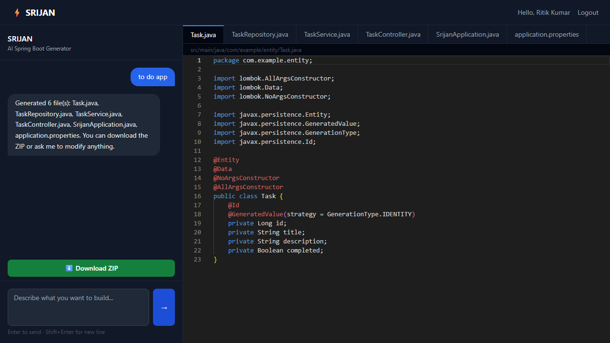

# ⚡ SRIJAN (Spring AI : Real-time Intelligent Java App Narrator) — AI-Powered Spring Boot Code Generator

> Describe your application requirements in plain English, and SRIJAN instantly generates a production-ready Spring Boot project with working Java code, schemas, and configurations.

[](https://openjdk.org/)
[](https://spring.io/projects/spring-boot)
[](https://react.dev/)
[](https://www.postgresql.org/)
[](https://www.docker.com/)

---

## 🏛️ Repository Structure

This repository is organized as a multi-module workspace containing both the backend service and frontend client:

```
SRIJAN/
├── srijan-backend/      # Spring Boot 3 + Spring AI + Java 17 service
└── srijan-frontend/     # React 19 + TypeScript + Vite + Monaco Editor client
```

---

## 📸 Screenshots

| Login | Dashboard |
|:---:|:---:|
|  |  |

| AI Todo App Scaffolder | Monaco Workspace (Banking System) |
|:---:|:---:|
|  |  |

---

## 🔗 Live Demo Links

| Service | Live Deployment URL |
| :--- | :--- |
| **🌐 Frontend Dashboard** | [https://srijanbyritik.vercel.app](https://srijanbyritik.vercel.app) |
| **🔧 Backend API Endpoint** | [https://srijan-backend-okdx.onrender.com](https://srijan-backend-okdx.onrender.com) |

---

## 📌 What is SRIJAN?

**SRIJAN** (which means *creation* in Sanskrit) is an AI-powered Spring Boot scaffolding platform. It allows developers to specify database schemas, controllers, and models in natural English, generating complete, compiling code immediately. 

Powered by **Spring AI** utilizing Groq's LLaMA-3.3 model, it generates fully written entities, repositories, security configs, and REST controllers. The generated project structure is rendered in a VS Code-like Monaco Editor in-browser and can be downloaded as a complete, runnable ZIP file.

---

## ✨ Features

- 🤖 **AI Code Generation** — Leverages Groq's fast `llama-3.3-70b-versatile` model via Spring AI.
- 💬 **Multi-turn Chat Memory** — Refine code outputs incrementally with conversational context persistence.
- 📝 **Monaco Code Editor** — Fully-featured files visualizer inside the browser with syntax highlighting.
- 📦 **ZIP Project Export** — Compiles the generated folder hierarchy into a ZIP archive, ready for import into IntelliJ, Eclipse, or VS Code.
- 🔐 **Spring Security 6 with JWT** — Secures access to user profiles and prompts logs using stateless JWT tokens.
- 🗂️ **Prompt History Logging** — Session histories are persisted in PostgreSQL, enabling account-based retrieval.

---

## 🛠️ Tech Stack

### Backend

| Technology | Purpose |
|---|---|
| Java 17 | Core language |
| Spring Boot 3.4.x | Backend framework |
| Spring AI 1.0.0-M6 | AI integration & chat memory |
| Groq API (LLaMA-3.3-70b-versatile) | LLM for project structure and code generation |
| Spring Security 6 + JWT | User authentication and API authorization |
| Spring Data JPA + Hibernate | ORM and database schema generation/access |
| PostgreSQL | Persistent relational database |
| Lombok | Boilerplate reduction |
| Maven | Project build tool |

### Frontend

| Technology | Purpose |
|---|---|
| React 19 | UI framework |
| TypeScript | Type-safe development |
| Vite | Frontend build tool and development server |
| Tailwind CSS | Utility-first responsive styling |
| Monaco Editor | In-browser code editor with syntax highlighting |
| React Router DOM v7 | Client-side routing |
| Axios | API calls with JWT authorization interceptors |

---

## 🚀 Getting Started (Local Setup)

### Prerequisites
- **Java 17+**
- **Maven 3.8+**
- **Node.js 18+**
- **PostgreSQL**
- **Groq API Key** (Get yours free at [console.groq.com](https://console.groq.com))

---

### 1. Backend Service Setup (`srijan-backend/`)

Navigate to the backend directory:
```bash
cd srijan-backend
```

Create a local database named `srijan_db` in PostgreSQL. 

Create a `.env` file in the `srijan-backend/` root directory:
```env
GROQ_API_KEY=your_groq_api_key_here
SPRING_DATASOURCE_URL=jdbc:postgresql://localhost:5432/srijan_db
SPRING_DATASOURCE_USERNAME=your_db_username
SPRING_DATASOURCE_PASSWORD=your_db_password
JWT_SECRET=your_jwt_secret_key_minimum_32_chars
CORS_ORIGIN=http://localhost:5173
```

Start the service:
```bash
./mvnw spring-boot:run
```
The backend API will start at `http://localhost:8080`.

---

### 2. Frontend Client Setup (`srijan-frontend/`)

Navigate to the frontend directory:
```bash
cd ../srijan-frontend
```

Install packages:
```bash
npm install
```

Create a `.env` file in the `srijan-frontend/` root directory:
```env
VITE_API_URL=http://localhost:8080
```

Launch the development server:
```bash
npm run dev
```
The client dashboard will be available at `http://localhost:5173`.

---

## 🐳 Docker Deployment

To launch the backend as a container:
```bash
cd srijan-backend
docker build -t srijan-backend .
docker run -p 8080:8080 \
  -e GROQ_API_KEY=your_groq_key \
  -e SPRING_DATASOURCE_URL=jdbc:postgresql://host.docker.internal:5432/srijan_db \
  -e SPRING_DATASOURCE_USERNAME=postgres \
  -e SPRING_DATASOURCE_PASSWORD=your_db_password \
  -e JWT_SECRET=your_jwt_secret \
  srijan-backend
```

---

## 🔌 API Reference

### Auth Endpoints

| Method | Endpoint | Description | Auth Required |
|---|---|---|---|
| POST | `/api/auth/register` | Register a new user | ❌ |
| POST | `/api/auth/login` | Login, returns JWT token and username | ❌ |

### AI Generation Endpoints

| Method | Endpoint | Description | Auth Required |
|---|---|---|---|
| POST | `/api/ai/generate` | Generates or modifies Spring Boot project structure | ✅ |
| GET | `/api/ai/download/{sessionId}` | Download the generated project ZIP archive. Custom naming: `?name=custom-name` | ❌ |

### Health Check

| Method | Endpoint | Description | Auth Required |
|---|---|---|---|
| GET | `/` | API status message | ❌ |
| GET | `/health` | Standard health indicator (returns "UP") | ❌ |

---

## 🔒 Security

- Passwords securely hashed using **BCryptPasswordEncoder**.
- REST endpoints secured stateless using **Spring Security 6** filter chains.
- Stateless authentication powered by JSON Web Tokens (**JWT**).
- Bearer token authentication automatically attached to frontend Axios requests via interceptors.
- Environment-level protection for sensitive configurations (CORS origins, database passwords, Groq API key).

---

## 🗄️ Database Schema

| Table | Purpose |
|---|---|
| `srijan_users` | Registered user profiles with hashed password credentials. |
| `chat_sessions` | Generation prompt sessions logged with UUID identifiers. |

---

## 👤 Author

**Ritik Hedau**
Java Full Stack Developer | Spring Boot | Spring AI | React
Location: India

[](https://github.com/ritik-hedau18)

---

## 🔗 Related Projects

| Project | Description |
|---|---|
| [NEXUS](https://github.com/ritik-hedau18/NEXUS) | AI-powered Multi-member RAG Workspace Intelligence Platform using Spring AI & Qdrant |
| [TRACE](https://github.com/ritik-hedau18/TRACE-Transaction-Risk-and-Anomaly-Classification-Engine) | Real-time fraud detection system using Spring Boot microservices + Kafka |

---

## 📄 License

This project is open source and available under the [MIT License](LICENSE).
